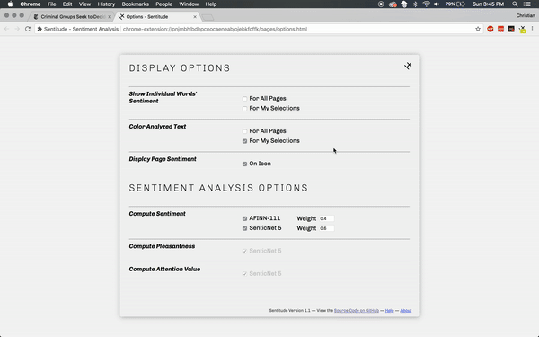

# Sentitude ± Sentiment Analysis in Chrome

Sentitude is a Chrome Extension that performs sentiment analysis on webpages and selections. It is lightweight and written in vanilla javascript with no dependencies, and makes no API calls. 


## Contents
- [Technologies](#technologies)
    - [How Sentitude Works](#how-sentitude-works)
        - [Negation and Lemmatization](#negation-&-lemmatization)
        - [Other Issues](#other-issues)
- [Using Sentitude](#using-sentitude)
    - [Analyzing Pages](#analyzing-pages)
    - [Analyzing Text](#analyzing-text)
- [Settings](#settings)
    - [Display Options](#display-options)
    - [Sentiment Analysis Options](#sentiment-analysis-options)
- [Privacy](#privacy)
- [License](#license)

## Technologies 

Sentitude makes use of two dictionaries when analyzing pages- [SenticNet 5](http://sentic.net/about/) and [AFINN-111](http://www2.imm.dtu.dk/pubdb/views/publication_details.php?id=6010). SenticNet 5 is the latest, released in 2018 ([read the paper here](http://sentic.net/senticnet-5.pdf)) and provides 100,000 concepts, each of which has been assigned a number of values, notably polarity, attention value, pleasantness, sensitivity, aptitude value, and a number of other semantics values. For example, the entry for `betray` in the SenticNet 5 dictionary looks like this: 
```json
{
    "betray": [
        "-0.50",
        "-0.18",
        "0.038",
        "-0.34",
        "#sadness",
        "#disgust",
        "negative",
        "-0.17",
        "leave_out",
        "unattractive",
        "cause_suffer",
        "loathing",
        "lose_team"
    ],
}
```
SenticNet 5 was created using a [recurrent neural network](https://en.wikipedia.org/wiki/Recurrent_neural_network) and the ["bag of concepts"](http://sentic.net/jumping-nlp-curves.pdf) model. The polarities of the words are inferred from a number of factors, most importantly the concept conveyed by the sentence and its collection of words. 

In addition, Sentitude makes use of the AFINN-111 dictionary. This dictionary is older, released in 2011 and containing 2,477 entries. Unlike the SenticNet dictionary, AFINN-111 was created manually by assigning a polarity value to each word or phrase based off of a number of factors. You can find out more by [reading the paper here](https://arxiv.org/pdf/1103.2903.pdf). The entry for `betray` in the AFINN-111 dictionary looks like this:
```json
{
    "betray":  -3,
}
``` 
Both of these dictionaries are useful when determining the sentiment of a piece of text, as each gives a different result. Neither is perfect, so the sentiment value that Sentitude produces is a combination of the two.  

### How Sentitude Works

Sentitude splits a text into "tokens"- individual words or phrases that have values attached. For example, consider the following sentence:
```
A lot of food can bring good fortune. 
```
Instead of splitting this sentence into eight separate words, Sentitude searches for the largest combination of words that can be combined that have an entry in a dictionary. In this case, the result would be split up into four tokens, like this:
```
[A lot of food] [can] [bring] [good fortune].
```
Now an aggregate score is created through a summation of all the token values, in this case the polarity:
```
[0.049] + [0] + [0.121] + [0.847]
```
The single word `can` was not in the dictionary, so it is given a token value of zero. Adding the values and dividing by the number of tokens:
```
0.049 + 0 + 0.121 + 0.847 = 1.017 / 4 = 0.25425
``` 
This sentence has a raw polarity of 0.25, which is then scaled on the range [-100, 100] and averaged with the polarity value obtained by following a similar process with the AFINN-111 dictionary. The average of the two is weighted more heavily towards the SenticNet dictionary by default, but this can be changed in the Sentitude options panel. The final sentiment of this sentence after averaging would be `+53`, a very positive score. 

#### Negation & Lemmatization

It is worth noting that this approach can be easily broken. For example, the sentence:
```
I don't want to go.
```
Would result in a positive score. This is why Sentitude includes a list of negators, which are compared against the tokens in a sentence. If one is found, in this case `don't`, the value of the following token, `want to go`, is inverted. Adding the token values would look like the following:
```
[I] + [don't] + -[want to go]
``` 
In addition, not all tenses of words are included in the dictionaries. For example, given the token `betrayed`, no value would be present. For this reason, Sentitude makes use of the [Porter Stemming Algorithm](https://tartarus.org/martin/PorterStemmer/) to normalize words. This way, literal words that are not in the dictionaries can still be identified by removing their suffixes and using their stems. 

#### Other Issues

The summation of tokens approach to sentiment analysis is by no means perfect, but it is fairly accurate. It tends to work best in comment sections and social media posts, where people often try to convey a very clear opinion on something. However, even in fairly unbiased news articles it can detect a slight polarity difference, just by an author's word choices. 

A major limiting factor is inability to detect sentiment given a certain context. For example, the word `apple` could be used in pretty much any context and carry completely a different meaning (ex. `What a delicous apple!` and `He was a real bad apple`.) In these cases Sentitude cannot accurately predict a sentiment; it just identifies tokens that are included in the two dictionaries and comes up with a less accurate number. 

## Using Sentitude

### Analyzing Pages

By default, Sentitude analyzes all pages you visit. To see the score of a page, click the Sentitude icon in the Chrome menu bar to open the popup menu. The page's value is also displayed in the badge on the Sentitude icon.


### Analyzing Text

There are a number of ways to analyze a single section of text. To begin, select the text you want to analyze. There are two ways to get its sentiment. 

You can right click and select `Get sentiment of selection` from the menu, or you can press `Command+Shift+A` for Mac and `Control+Shift+A` for Windows and others. 


The sentiment value will by default appear on the text you selected. If not, it can always be found in the popup menu. 


If you'd like to select more than one paragraph at once, *do not* highlight the text. Instead, open the popup menu and choose `Select Paragraphs`. Now, you can click on any paragraphs on the page to get their sentiment values.  


## Settings

### Display Options 

The `Show Individual Words' Sentiments` setting allows you to toggle the display of individual words' sentiment values. With this setting enabled, each recognized word in a selection or page is highlighted in a color that represents its sentiment value. Hovering over each word displays more information about its sentiment. 


The `Color Analyzed Text` setting allows you to toggle the display of a selection or page's sentiment value and color representation. With this setting enabled, a highlight color is placed around the selection and hovering over it displays more information about its sentiment. With this setting disabled, your pages and selections are not changed visually, but their sentiment values can still be found in the popup window. 



The `Display Page Sentiment` setting allows you to toggle the display of the page's sentiment on the Sentitude icon in the toolbar. Disabling this option removes the sentiment value from the icon. 

### Sentiment Analysis Options 

In this section, you can edit which dictionaries are used to calculate the sentiment for your pages and selections. You can disable one or the other and change the weights of each. It is not recommended that you change these settings much, as they are set optimally by default. 

## Privacy

Sentitude is completely self-contained; it gets no information in and sends no information out. None of generated sentiment values are saved. It stores and syncs just *nine* settings across your devices. If you don't want Sentitude to sync anything, navigate to [chrome://settings](chrome://settings), click `Sync`, and disable `Extensions`. 

## Licence 

Sentitude is licenced under the MIT Licence. 

Copyright (©) 2018 Christian Broms
